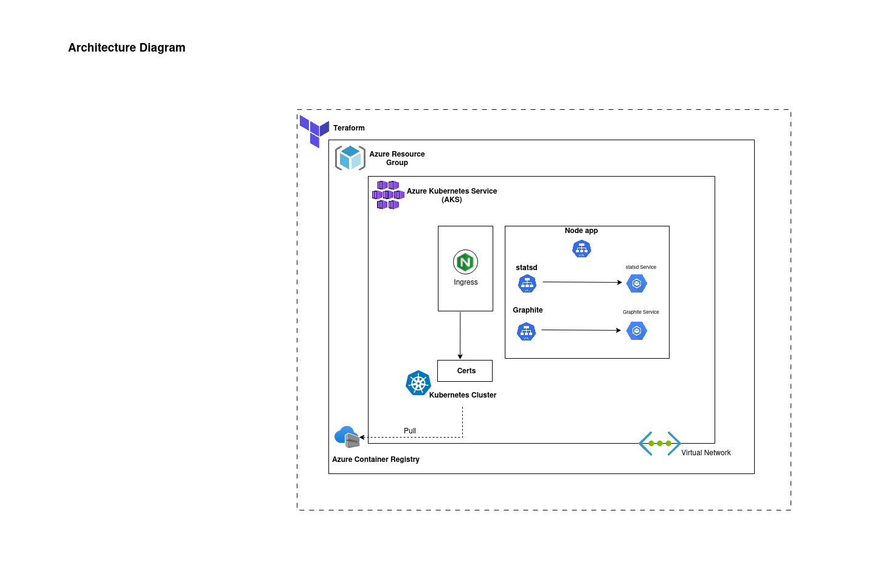

## Introduction

This is a technical test for the role of **DevOps Engineer**.

## Diagram

## Create AKS Cluster
  
  1. Change dir to Teraform Script.
  2. Update variable
  3. RUN Terraform script to create ACR and AKS Custer

## Graphite
  
  1. Change dir to Graphite.
  2. Deploy graphite.yaml and graphite_service.yaml on AKS with image ([Graphite Image](graphiteapp/graphite-statsd)). 
  3. Graphte port which needs to be expose 2023, 2024.

## Statsd
  
  1. git clone stasd repo. ([Statsd Repo](https://github.com/statsd/statsd))
  2. Change dir to statsd
  3. Replace line 24 with [sed -i 's/graphite.example.com/<graphite-service>/' config.js]    # Service name or ip of service
  3. Run command docker build -t <Repo_name>:<tag>  
  4. Docker push image to ACR. 
  5. Change dir to Statsd and deploy statsd.yaml and statsd_service.yaml on AKS. # update image name in statsd.yaml

## Containerize Node App

  1. Run command docker build -t <Repo_name>:<tag> --build-arg METRICS_HOST= <statsd-service> # Service name or ip of service
  2. Docker push image to ACR.
  5. Change dir to Node_app and deploy node_app.yaml on AKS. # update image name in node_app.yaml

## Summary
Node app will send metics to statsd on port 8125/udp, statsd will store that metrics and send to Graphite backend on port 2023 for visualization.

## Note
We can implement different  stratigies to deploy these micro services but in this scenario  we are just deploying these micro services to run.
